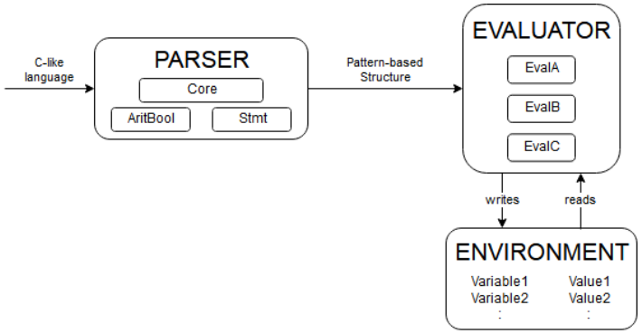
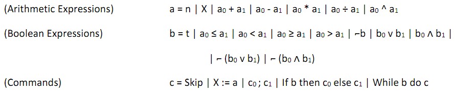

# Atomic Interpreter

An interpreter for an imperative language.

## Introduction
The major concern of this project is the development of a monadic recursive interpreter able to:

* parse C-like fundamental instructions,
* keep track of the values for the declared variables, stored in the environment.

The interpreter is called "Atomic Interpreter". It has been named in this way because each atomic part was developed one by one from scratch without the use of libraries.

## Architecture
The architecture of the system is very modular and it is composed of two main parts:
* The Parser. It contains the core of the system and the modules that help in the recognition of the arithmetic/boolean expressions and statements. During the phase of code analysis, this module is required to analyze token by token the string in input (the c-like code) and it builds in output a formalized structure obtained by the patter-based analysis.
* The Evaluator. It contains the single evaluators for each kind of expression (arithmetic/boolean) or statement. During the phase of evaluation, it creates an environment that stores the local variables and it is updated by the evaluator itself. It requires in input the formalized structure that was produced by the Parser and provides an updated environment.

## The While language

The designed language to be analyzed and understood by this interpreter is the While. It is a simplified imperative language that presents the elementary operations and structures of every imperative language. As every language, it stands on a grammar and here are the basic rules:

## Usage

1. Compile the module AtomicInterpreter.hs.
2. Run: 
   * the "main" function to launch the interpreter.
   * the "mainParser" function to launch the parser.
3. Write the code in While on a single line, dividing instructions with semicolons.

## Authors

All the following authors have equally contributed to this project (listed in alphabetical order by surname):

- Tiziano Franza ([github](https://github.com/frantiz96))
